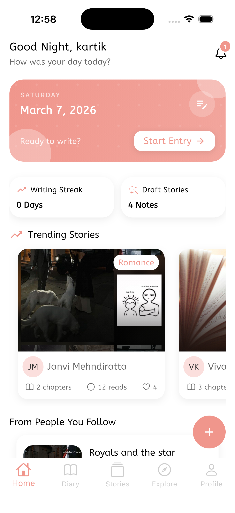
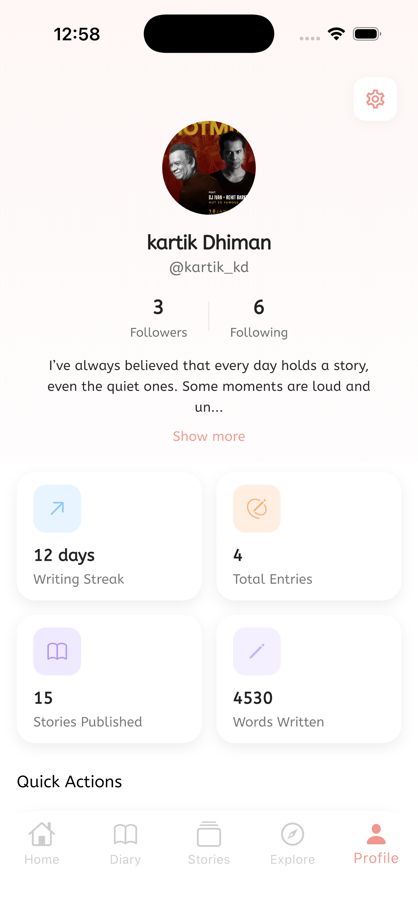

# MindLoom 📚✨

MindLoom is a storytelling platform where users can **write, publish, and discover stories** from writers around the world.

The app focuses on creativity, discovery, and community-driven storytelling while providing a smooth and personalized reading experience.

Users can follow writers, explore trending stories, and build their own audience by sharing their creations.

---

# 🚀 Features

- ✍️ Write and publish stories
- 📖 Read stories from other writers
- 👥 Follow / unfollow users
- 📰 Personalized feed from followed writers
- 🔍 Explore trending stories
- ❤️ Like and engage with stories
- 💬 Submit feedback
- 🖼 Cached network images for faster loading
- 📱 Smooth and responsive UI

---

# 🏗 Architecture

The project follows **Clean Architecture** with clear separation of concerns.

lib/
│
├── core
├── config
├── features
│ ├── auth
│ ├── explore
│ ├── story
│ ├── user
│ ├── feedback
│ └── home

### Layers Used

**Presentation Layer**
- UI
- Controllers
- State management

**Domain Layer**
- Entities
- Use cases
- Business logic

**Data Layer**
- Repositories
- Data sources
- Models

State management is handled using **GetX**.

---

# 🛠 Tech Stack

## Frontend
- Flutter
- Dart
- GetX (State Management)

## Backend
- Firebase Authentication
- Cloud Firestore
- Firebase Storage

## Local Storage
- SQLite (sqflite)

## Other Packages
- Cached Network Image
- Path Provider
- Cloud Firestore SDK

---

# 📸 Screenshots

| Home Feed | Profile View |
|-----------|------------|
| |  |

---

# 🚧 Project Status

The project is currently **under active development**.

### Planned Features

- Push notifications
- Story bookmarks
- Advanced search
- Story analytics

---

# 🤝 Contributing

Contributions are welcome.

1. Fork the repository
2. Create a new branch
3. Commit your changes
4. Open a pull request

---

# 📄 License

This project is licensed under the **MIT License**.

---

# 👨‍💻 Author

Developed by **Karti**

If you like this project, consider giving it a ⭐ on GitHub.